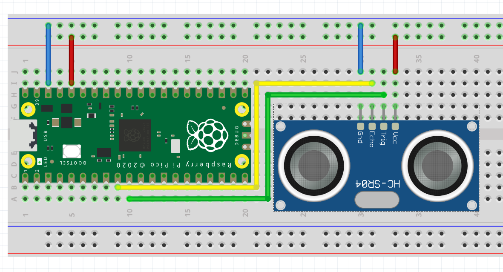

In this post we will see how to wire up an HC-SR04 range sensor to the Raspberry Pi Pico and publish its readings to the ROS 2 graph using micro-ROS.
This builds upon the previous post ['Getting started with micro-ROS on the Pi Pico'][pico_setup],
as such I'd encourage you to read it first if you are not already familiar with the topic.

---

## Content

- [A sensor you said?](#a-sensor-you-said)
  - ["I'm Bat(sensor)"](#im-batsensor)
  - [Which sonar model to pick?](#which-sonar-model-to-pick)
- [Wiring up the sonar to the Pi Pico](#wiring-up-the-sonar-to-the-pi-pico)
  - [Micro code for micro-ROS](#micro-code-for-micro-ros)
  - [Bip bip bip](#bip-bip-bip)
- [What's next?](#whats-next)

---

## A sensor you said?

In this tutorial, we will make use of one of the most common sensors in robotics, a sonar.
These sensors are cheap, fairly simple to use and surprisingly precise under favorable circumstances.
Sonars are used to measure distances and can therefore be used to detect and locate obstacles so that one can make sure its robot does not run into nearby things.
It is no mystery why they are so incredibly popular.

So, what's a sonar, how does it work, which one should I pick?

### "I'm Bat(sensor)"

A sonar is an echolocation sensor which allows for measuring distances.
To keep things simple to digest,
sonars work the same way as bats do.
Nah they don't fly, hunting bugs at dawn;
nor do they fight crime.
I obviously meant the same way as bats perceive the world.
A sonar is composed of an emitter and a receiver.
The former emits an ultrasound signal,
which will bounce off of facing obstacles,
back at the receiver.
Measuring the time difference between the signal emission and reception,
one can easily calculate the distance travelled by the sound wave and thus the distance to the obstacle that reverberated the sound.

This technology can suffer from all kind of issues if, for example,
the sound wave is reverberated away from the sensor,
or if it is reverberated back to the sensor by two obstacles at different distances,
or if it is absorbed by some sound dampening material.

If this is still unclear or you want to know more about it,
I'll redirect you to your favorite web search engine as it is a little out of the scope of this post.

### Which sonar model to pick?

There exists plenty different models of sonars,
fortunately most of them works the same way.
Furthermore they can be found for a few bucks per unit on the internet.
Head on over to your favorite electronics supplier and you're sure to find them for sale.

I'd recommend you use the 'HC-SR04P' model which is the 3.3V variant of the immensely popular 'HC-SR04' (5V).
It is this model (the 'HC-SR04P') I will be using in this post.
Given its very small power consumption, it can be powered up directly from the Pi Pico and thus the whole setup can simply be powered from the USB cable.
In case you are using a 5V package, make sure to adapt the wiring described below or else you are risking damages to your Pi Pico!
For reference, I ordered a lot of 5 units for less than 10$ including shipping.
Including the Pi Pico price,
that's a lot of sensing for the price!

## Wiring up the sonar to the Pi Pico

The 'HC-SR04P' board comes with four pins labelled
'Vcc', 'Gnd', 'Trig' and 'Echo'.
As you've already guessed, the Vcc and Gnd pins are for the 3.3V line and the ground respectively,
while 'Trig' is used to trigger the sensor and 'Echo' reports the reception of the echo (the reception of the sound wave that bounced off of an obstacle).

From there, and referring to the [Pi Pico pinout][pico_pinout],
the wiring is straight forward:

- connect Pico's pin 36 (3V3 OUT) to the sonar's 'Vcc'
- connect Pico's pin 38 (GND) to the sonar's 'Gnd'
- connect Pico's pin 9 (GPIO 6) to the sonar's 'Echo'
- connect Pico's pin 10 (GPIO 7) to the sonar's 'Trig'

This setup is depicted in the figure below.



As far as the hardware goes, we're done.
Let us move to the software.

### Micro code for micro-ROS

We've seen in the ['previous post'][pico_setup] how to set up VSCode for programming micro-ros, and how to compile and flash a program on the Pi Pico.
We'll thus refer to the aforementioned post on how to do all that and skip it here.
Similarly, we'll skip all the boilerplate code and only show the bits specific to our application.
However, know that this example (and more) is fully available on github at [artivis/mico_ros][mico_ros].

Alright, let's dive a little.
Our application is essentially composed of two functions,
one that triggers and reads the sensor,
and a second, the timer callback, which calls the first,
fill up a ROS message and publishes it:

```cpp
...

// The GPIO pins to which the sonar is wired
#define GPIO_ECHO 6
#define GPIO_TRIGGER 7

/**
 * @brief Get the range value in meter.
 */
float read_range() {

  // Send an impulse trigger of 10us
  gpio_put(GPIO_TRIGGER, 1);
  sleep_us(10);
  gpio_put(GPIO_TRIGGER, 0);

  // Read how long is the echo
  uint32_t signaloff, signalon;
  do {
    signaloff = time_us_32();
  } while (gpio_get(GPIO_ECHO) == 0);

  do {
    signalon = time_us_32();
  } while (gpio_get(GPIO_ECHO) == 1);

  // Actual echo duration in us
  const float dt = signalon - signaloff;

  // distance in meter:
  // echo duration (us) x speed of sound (m/us) / 2 (round trip)
  return dt * 0.000343 / 2.0;
}

...

/**
 * @brief Read the range from the sensor,
 * fill up the ROS message and publish it.
 */
void timer_callback(rcl_timer_t *timer, int64_t /*last_call_time*/) {
  if (timer) {
    range_msg.range = read_range();
    fill_msg_stamp(range_msg.header.stamp);
    rcl_publish(&publisher, &range_msg, NULL);
  } else {
    printf("Failed to publish range. Continuing.\n");
  }
}

...

```

That's pretty much it.
The rest of the code is mostly boilerplate,
initializing the GPIO,
setting up the micro-ROS node, publisher, timer and executor,
and having it all spin.

Note that we are using the standard `sensor_msgs/msgs/Range` message.
You can find its definition and a breakdown of its field online in the [ROS2 API documentation][range_api].

All there is to do now is to compile the code,
flash the resulting '.uf2' file and start the micro-ROS agent.

### Bip bip bip

Assuming compiling and flashing went all fine,
all we have to do is to plug the board to our computer and launch the micro-ROS agent.
We do so with the following command:

```bash
docker run -it --rm -v /dev:/dev --privileged --net=host microros/micro-ros-agent:foxy serial --dev /dev/ttyACM0 -b 115200
```

Let's see if we get anything,

```bash
$ ros2 topic list
/parameter_events
/pico/range
/rosout
```

the topic `/pico/range` is advertised, that's a good start.
Let see what it contains,

```bash
$ ros2 topic echo /pico/range
header:
  stamp:
    sec: 145
    nanosec: 837599000
  frame_id: pico_sonar_0_link
radiation_type: 0
field_of_view: 30.0
min_range: 0.019999999552965164
max_range: 4.0
range: 12.138598442077637
---
header:
  stamp:
    sec: 145
    nanosec: 915356000
  frame_id: pico_sonar_0_link
radiation_type: 0
field_of_view: 30.0
min_range: 0.019999999552965164
max_range: 4.0
range: 12.138941764831543
---

...
```

That looks great!

You could now play with your new sensor,
moving an obstacle back and forth in front of it.
Take a measuring tape and compare the reported distance to the measured one,
you may be surprised by its accuracy, I know I was.

## What's next?

This is a neat little project to approach micro-ROS and the possibilities it opens.
Indeed it is really rewarding to see the actual distance between the sensor and an obstacle being readily available on our ROS 2 graph.
But taking a step back we can start seeing an slightly larger picture;
a picture in which one will be able to easily, effortlessly,
add plug'n'play ROS2-ready hardware modules to existing robots.
Plug a camera and its feed magically appears on the graph,
an IMU module could provide a reliable odometry source,
a motor ready to spin in a snap (pun intended).

We're not there yet, but I'm definitely going to follow this line of thought for my own Turtlebot 3.
Can you believe that it doesn't have any sonar?!

Fortunately now I can easily add a pair of them and have my robot stop bumping into my lazy cat lying down on the floor,
unwitting ninja, invisible to the laser scanner :sweat_smile:.

[//]: # (URLs)

[pico_setup]: pi-pico-uros-getting-started.md
[pico_pinout]: https://datasheets.raspberrypi.org/pico/Pico-R3-A4-Pinout.pdf

[mico_ros]: https://github.com/artivis/mico_ros
[micro_ros_agent_issue]: https://github.com/micro-ROS/micro-ROS-Agent/issues/63

[range_api]: https://docs.ros2.org/latest/api/sensor_msgs/msg/Range.html
